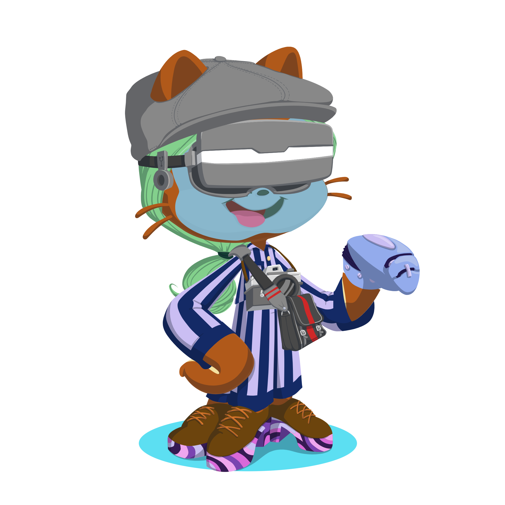
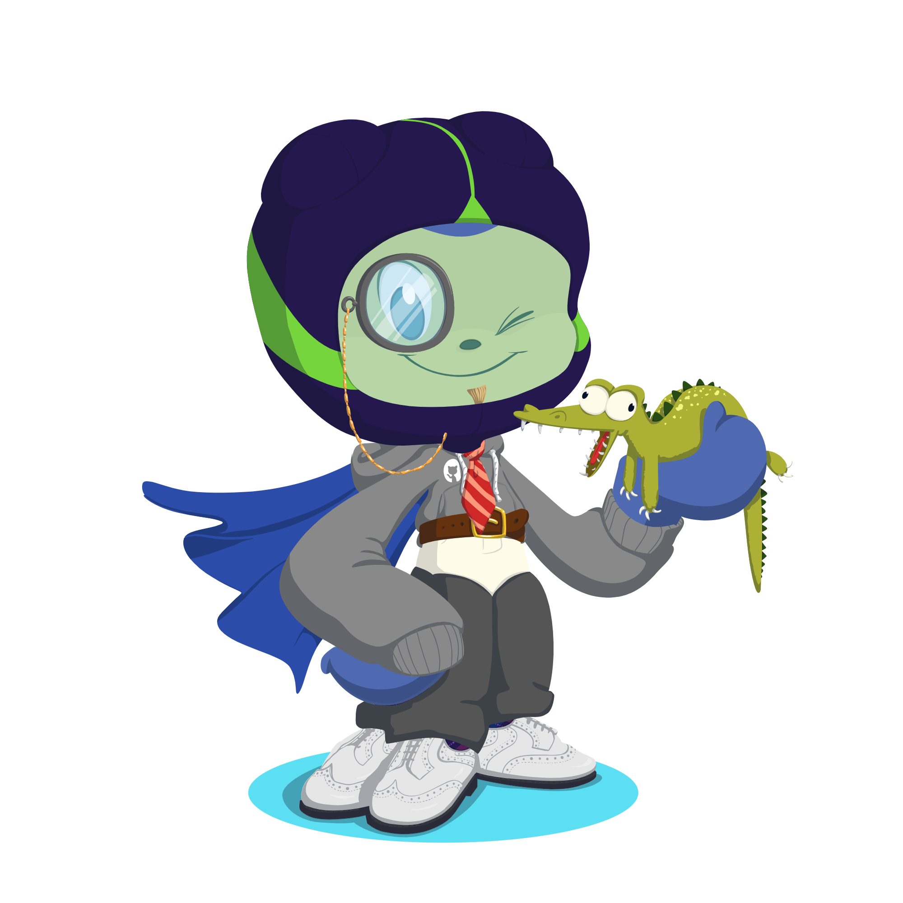

# Git and github laboratory

Git practice laboratory

Paolo Zesati

## Description
Gitt

## Contents

### Images





### Code Examples 

```python print(2+2) ```

### Lists

- [ ] Turn on GitHub Pages
- [ ] Outline my portfolio
- [ ] Introduce myself to the world

## References

Github documentation: https://docs.github.com/en
Github glossary: https://docs.github.com/en/get-started/learning-about-github/github-glossary
Git documentation: https://git-scm.com/doc
